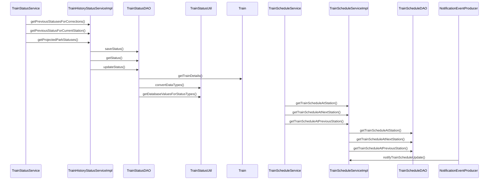

```mermaid
sequenceDiagram
    participant TrainStatusService
    participant TrainHistoryStatusServiceImpl
    participant TrainStatusDAO
    participant TrainStatusUtil
    participant Train
    participant TrainScheduleService
    participant TrainScheduleServiceImpl
    participant TrainScheduleDAO
    participant NotificationEventProducer
    TrainStatusService->>TrainHistoryStatusServiceImpl: getPreviousStatusesForCorrections()
    TrainStatusService->>TrainHistoryStatusServiceImpl: getPreviousStatusForCurrentStation()
    TrainStatusService->>TrainHistoryStatusServiceImpl: getProjectedParkStatuses()
    TrainHistoryStatusServiceImpl->>TrainStatusDAO: saveStatus()
    TrainHistoryStatusServiceImpl->>TrainStatusDAO: getStatus()
    TrainHistoryStatusServiceImpl->>TrainStatusDAO: updateStatus()
    TrainStatusDAO->>Train: getTrainDetails()
    TrainStatusDAO->>TrainStatusUtil: convertDataTypes()
    TrainStatusDAO->>TrainStatusUtil: getDatabaseValuesForStatusTypes()
    TrainScheduleService->>TrainScheduleServiceImpl: getTrainScheduleAtStation()
    TrainScheduleService->>TrainScheduleServiceImpl: getTrainScheduleAtNextStation()
    TrainScheduleService->>TrainScheduleServiceImpl: getTrainScheduleAtPreviousStation()
    TrainScheduleServiceImpl->>TrainScheduleDAO: getTrainScheduleAtStation()
    TrainScheduleServiceImpl->>TrainScheduleDAO: getTrainScheduleAtNextStation()
    TrainScheduleServiceImpl->>TrainScheduleDAO: getTrainScheduleAtPreviousStation()
    NotificationEventProducer->>TrainScheduleServiceImpl: notifyTrainScheduleUpdate()
```
