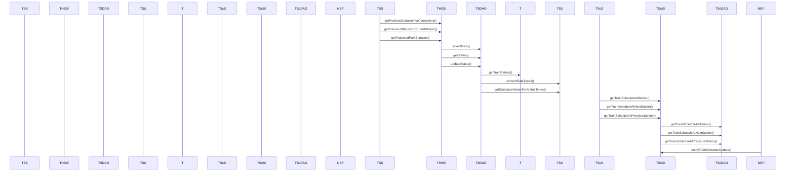

```mermaid
sequenceDiagram
    participant TrainStatusService as TSS
    participant TrainHistoryStatusServiceImpl as THSSI
    participant TrainStatusDAO as TSDAO
    participant TrainStatusUtil as TSU
    participant Train as T
    participant TrainScheduleService as TScS
    participant TrainScheduleServiceImpl as TScSI
    participant TrainScheduleDAO as TScDAO
    participant NotificationEventProducer as NEP
    TSS->>THSSI: getPreviousStatusesForCorrections()
    TSS->>THSSI: getPreviousStatusForCurrentStation()
    TSS->>THSSI: getProjectedParkStatuses()
    THSSI->>TSDAO: saveStatus()
    THSSI->>TSDAO: getStatus()
    THSSI->>TSDAO: updateStatus()
    TSDAO->>T: getTrainDetails()
    TSDAO->>TSU: convertDataTypes()
    TSDAO->>TSU: getDatabaseValuesForStatusTypes()
    TScS->>TScSI: getTrainScheduleAtStation()
    TScS->>TScSI: getTrainScheduleAtNextStation()
    TScS->>TScSI: getTrainScheduleAtPreviousStation()
    TScSI->>TScDAO: getTrainScheduleAtStation()
    TScSI->>TScDAO: getTrainScheduleAtNextStation()
    TScSI->>TScDAO: getTrainScheduleAtPreviousStation()
    NEP->>TScSI: notifyTrainScheduleUpdate()
```
