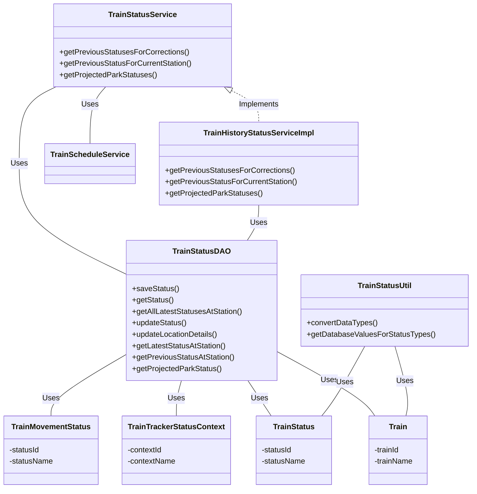

```mermaid
classDiagram
    TrainStatusService <|.. TrainHistoryStatusServiceImpl: Implements
    TrainStatusService -- TrainStatusDAO: Uses
    TrainStatusService -- TrainScheduleService: Uses
    TrainHistoryStatusServiceImpl -- TrainStatusDAO: Uses
    TrainStatusDAO -- Train: Uses
    TrainStatusDAO -- TrainStatus: Uses
    TrainStatusDAO -- TrainTrackerStatusContext: Uses
    TrainStatusDAO -- TrainMovementStatus: Uses
    TrainStatusUtil -- TrainStatus: Uses
    TrainStatusUtil -- Train: Uses
    class TrainStatusService {
        +getPreviousStatusesForCorrections()
        +getPreviousStatusForCurrentStation()
        +getProjectedParkStatuses()
    }
    class TrainHistoryStatusServiceImpl {
        +getPreviousStatusesForCorrections()
        +getPreviousStatusForCurrentStation()
        +getProjectedParkStatuses()
    }
    class TrainStatusDAO {
        +saveStatus()
        +getStatus()
        +getAllLatestStatusesAtStation()
        +updateStatus()
        +updateLocationDetails()
        +getLatestStatusAtStation()
        +getPreviousStatusAtStation()
        +getProjectedParkStatus()
    }
    class TrainStatusUtil {
        +convertDataTypes()
        +getDatabaseValuesForStatusTypes()
    }
    class Train {
        -trainId
        -trainName
    }
    class TrainStatus {
        -statusId
        -statusName
    }
    class TrainTrackerStatusContext {
        -contextId
        -contextName
    }
    class TrainMovementStatus {
        -statusId
        -statusName
    }
```
